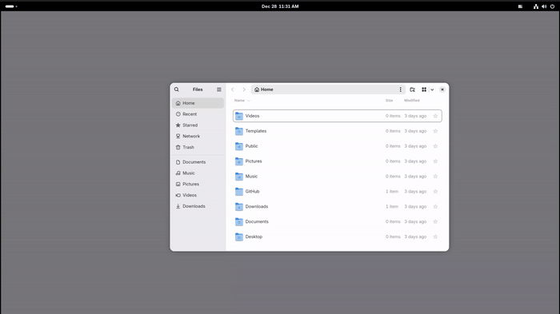
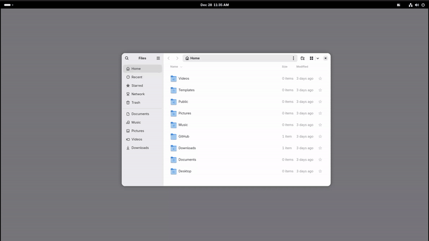
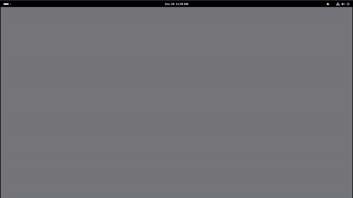
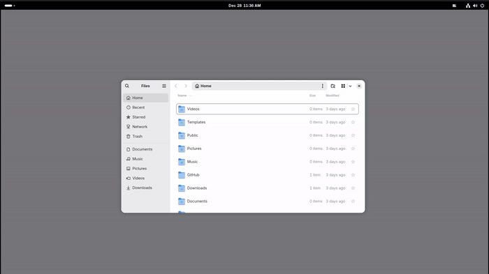

<div align="center">

Custom window zones for GNOME

[](LICENSE)
[](https://extensions.gnome.org/)

</div>

---

## What is Zoned?

GNOME gives you one layout: 50/50 left/right. On an ultrawide, that's two unusably wide windows. Zoned lets you define any layout you want.

**The in-between you've been missing**: Zoned sits between full tiling window managers and free-floating chaos. Define custom zones, snap windows with keyboard shortcuts, or ignore it entirely-Zoned won't fight you.



### Features

- **Custom zone profiles** - Define layouts that match how you actually work
- **Visual zone editor** - Create and edit zones without touching config files
- **Keyboard-driven snapping** - Move windows between zones with shortcuts
- **Multi-monitor support** - Different layouts for different displays
- **Workspace-aware** - Integrates with GNOME's workspace system
- **X11 + Wayland** - Works on both display protocols
- **State persistence** - Remembers your layout and zones across sessions
- **Auto-fix conflicts** - Detects and resolves keyboard shortcut conflicts with GNOME

### Who it's for

Everyone. Zoned works on any monitor and resolution.

That said—if you've got an ultrawide and wondered why Linux makes you choose between 50/50 splits or a full tiling WM, this is for you.

---

## Quick Install

```bash
git clone https://github.com/hamiltonia/zoned.git
cd zoned
make dev
```

Then reload GNOME Shell:
- **Wayland:** Log out → Log back in
- **X11:** `Alt+F2` → type `r` → Enter

---

## Basic Workflow


1. **Choose a layout:** Press `Super+grave` to open the Layout Switcher
2. **Select a layout** (e.g., "Split", "Triple", "Wide")
3. **Snap windows:** Focus any window and press `Super+Right` to snap it to the next zone
4. **Repeat:** Focus another window, press `Super+Right` again to fill the layout

Your layout choice persists—just snap windows as you open them.

---

## Keyboard Shortcuts



| Shortcut | Action |
|----------|--------|
| `Super+Left` | Snap window to previous zone |
| `Super+Right` | Snap window to next zone |
| `Super+grave` | Open Layout Switcher (backtick key) |
| `Super+Up` | Maximize/restore window |
| `Super+Down` | Minimize window |

> **Note:** `Super` is the Windows key (⊞)



---

## Built-in Layout Templates

Five templates for common workflows:

| Layout | Description |
|--------|-------------|
| Split | Two equal halves (50/50) |
| Triple | Three equal columns (33/33/33) |
| Wide | Center-focused (25/50/25) |
| Quarters | 2×2 grid |
| Triple Stack | Three columns with stacked right panel |

### Custom Layouts



Create your own using the **Layout Switcher** and **Zone Editor**:

1. Press `Super+grave` to open the Layout Switcher
2. Click "New Layout" to create a custom layout
3. Use the visual zone editor to define your zones

**Complete Tutorial:**


---

## Troubleshooting

**Extension not loading?**
```bash
gnome-extensions list --enabled | grep zoned  # Check if enabled
make logs                                      # View errors
gsettings reset-recursively org.gnome.shell.extensions.zoned  # Reset
```

**Keyboard conflicts?** Look for the orange indicator in your panel → Click → "Auto-Fix Conflicts"

---

## For Developers

**VM Development:** Use the `vm` script for all VM operations:
```bash
./scripts/vm setup         # Configure VM
./scripts/vm logs          # Watch VM logs  
./scripts/vm test func     # Run tests
make vm-install            # Deploy to VM
```

See [scripts/README.md](scripts/README.md) for complete VM command reference.

## Documentation

| Document | Description |
|----------|-------------|
| [DEVELOPMENT.md](DEVELOPMENT.md) | Developer quick reference, Makefile commands |
| [scripts/README.md](scripts/README.md) | VM development scripts and commands |
| [CONTRIBUTING.md](CONTRIBUTING.md) | Contribution guidelines, code style, PR process |
| [docs/architecture.md](docs/architecture.md) | Component overview, system design |
| [docs/keybindings.md](docs/keybindings.md) | Complete keyboard shortcut reference |
| [docs/technical-specs.md](docs/technical-specs.md) | Data structures, edge layouts |
| [docs/coding-patterns.md](docs/coding-patterns.md) | Code style guide |
| [docs/vm-setup-guide.md](docs/vm-setup-guide.md) | VM development environment setup |
| [docs/testing-strategy.md](docs/testing-strategy.md) | Testing strategy and VM test infrastructure |
| [ROADMAP.md](ROADMAP.md) | Planned features and project direction |
| [CHANGELOG.md](CHANGELOG.md) | Version history and release notes |

---
## About This Project

I use a 5120×1440 super-ultrawide and work across macOS, Windows, and Linux. On Windows, FancyZones handles window management perfectly. On macOS, I built a solution with Hammerspoon. On GNOME? Nothing came close. Existing options were either full tiling window managers (too rigid) or basic extensions (too limited).

So I built Zoned.

### Built with AI

This project is 100% AI-generated code. Not AI-assisted--AI-generated. I used VS Code with Cline as the agentic coding interface, powered by Claude Opus 4.5 and Sonnet 4.5. My role was architecture, direction, and review. The AI wrote every line.

It started as a learning exercise in AI-assisted development workflows. It turned into something I use daily.

Not commercial--just giving back to the Linux community. Contributions welcome.

---

## Contributing

See [CONTRIBUTING.md](CONTRIBUTING.md) for guidelines.

**Ways to help:**
- Testing on different GNOME versions
- Bug reports and fixes
- Documentation improvements
- New layout designs

---

## Acknowledgments

- **Windows PowerToys FancyZones** - Original inspiration for zone-based window management
- **GNOME Shell** - Excellent extensibility platform

---

<div align="center">

🐛 [Report bugs](https://github.com/hamiltonia/zoned/issues) · 💬 [Discussions](https://github.com/hamiltonia/zoned/discussions)


</div>
